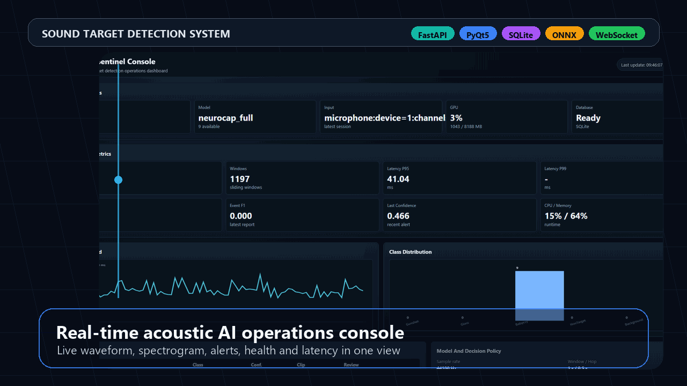
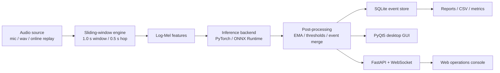

<div align="center">

# Sound Target Detection System

**An online acoustic event monitoring stack for real-time target detection, model serving, event review, and edge deployment.**

[](https://www.python.org/)
[](https://pytorch.org/)
[](https://fastapi.tiangolo.com/)
[](https://onnx.ai/)
[](#license)



<p>
  <a href="#quick-start"><strong>Quick Start</strong></a> ·
  <a href="#what-it-does"><strong>Features</strong></a> ·
  <a href="#architecture"><strong>Architecture</strong></a> ·
  <a href="#edge-ai--inference"><strong>Edge AI</strong></a> ·
  <a href="#model-files"><strong>Model Files</strong></a> ·
  <a href="#docs"><strong>Docs</strong></a>
</p>

</div>

---

## Why This Project

This repository turns a five-class sound target detector into a deployable online system.
It is not just an offline classifier script: it includes a streaming engine, desktop GUI,
FastAPI service, Web operations console, SQLite event store, model registry, online replay
evaluation, ONNX export tools, and edge deployment templates.

Target classes:

| Target | Target | Target | Control | Control |
|---|---|---|---|---|
| Gunshot | Glass break | Baby cry | Non-target event | Background |

> Large checkpoints, ONNX engines, local datasets, runtime outputs, reports, screenshots,
> and personal research documents are intentionally excluded from the public repository.

---

## What It Does

| Area | Capability |
|---|---|
| Online audio | 44.1 kHz mono stream, 1.0 s window, 0.5 s hop, microphone and replay inputs |
| Detection engine | Unified windowing, feature extraction, inference, post-processing, alert callbacks |
| Desktop console | PyQt5 GUI with waveform, spectrogram, event table, model selection, thresholds, review |
| Local observability | Desktop runtime panel for CPU, memory, GPU, disk, windows, events, latency P95/P99, queue status |
| Web console | Browser dashboard at `/console` with events, latency, status, class distribution |
| Service API | FastAPI REST endpoints, OpenAPI docs, WebSocket stream, Prometheus-style `/metrics` |
| Event store | SQLite sessions, events, window predictions, audio clips, model registry, audit logs |
| Model ops | Checkpoint availability checks, smoke inference, model registry, backend shadow hooks |
| Edge AI | ONNX export, ONNX Runtime validation, backend benchmark, continuous batching, Triton template |

---

## Architecture



---

## Quick Start

```powershell
git clone https://github.com/Jatshi/sound-target-detection-system.git
cd sound-target-detection-system

python -m venv .venv
.\.venv\Scripts\activate
pip install -r requirements.txt

python -m compileall src scripts
python scripts\run_service.py
```

Open:

- API docs: [http://127.0.0.1:8765/docs](http://127.0.0.1:8765/docs)
- Web console: [http://127.0.0.1:8765/console](http://127.0.0.1:8765/console)

Desktop GUI:

```powershell
python scripts\run_desktop.py
```

Online replay smoke evaluation:

```powershell
python scripts\run_online_eval.py --quick
```

---

## Model Files

Model weights are not stored in Git. Place your own checkpoints under:

```text
models/neurocap_full/model.pt
models/neurocap_resnet10/model.pt
models/baselines/resnet10.pt
models/baselines/dilated.pt
models/baselines/deformable.pt
models/baselines/paulnet.pt
models/baselines/gtcnn.pt
models/baselines/dualbranch.pt
models/edge/neurocap_resnet10_opt.onnx
```

Missing files are reported as unavailable by the model registry. The system does not
silently fall back to a different model.

---

## Edge AI & Inference

The deployment path separates the online audio pipeline from the model backend. This keeps
the runtime easy to validate and makes edge optimization explicit.

```powershell
# Export an ONNX model
python scripts\export_onnx.py --model neurocap_resnet10 --mode spec

# Validate ONNX Runtime against the PyTorch wrapper
python scripts\validate_export.py --backend onnxruntime-cpu ^
  --model neurocap_resnet10 ^
  --onnx models\edge\neurocap_resnet10_opt.onnx ^
  --n 64

# Benchmark latency and throughput
python scripts\benchmark_backend.py --backend onnxruntime-cpu ^
  --model neurocap_resnet10 ^
  --model-path models\edge\neurocap_resnet10_opt.onnx ^
  --batch-sizes 1,4,16
```

Included deployment templates:

- Docker CPU service
- Docker GPU service
- Jetson Docker starter
- Linux `systemd` unit
- Triton model repository skeleton
- Kubernetes deployment and HPA template

---

## Repository Layout

```text
configs/       Runtime configuration templates
src/sounddet/  Core package: engine, GUI, API service, metrics, storage, model adapters
scripts/       Runtime, evaluation, export, benchmark, and packaging commands
web/           Static Web operations console
deploy/        Docker, Triton, systemd, and Kubernetes deployment templates
packaging/     Packaging helpers
models/        Placeholder directories for user-provided model files
docs/          Public user, API, deployment, database, and troubleshooting docs
```

---

## Docs

| Document | Description |
|---|---|
| [User Manual](docs/user_manual.md) | Desktop GUI, Web console, sessions, events, reports |
| [API](docs/api.md) | FastAPI endpoints and service usage |
| [Deployment](docs/deployment.md) | Local service, Docker, systemd, and Windows notes |
| [Edge Deployment](docs/edge_deployment.md) | ONNX/TensorRT/Triton-oriented deployment path |
| [Database Schema](docs/database_schema.md) | SQLite tables and stored artifacts |
| [Troubleshooting](docs/troubleshooting.md) | Common runtime and model-loading issues |

---

## Git Policy

The public repository is intentionally source-first. Do not commit:

- local datasets
- runtime outputs
- logs
- checkpoints
- ONNX/TensorRT engines
- SQLite databases
- screenshots and videos generated during local runs
- packaged binaries

These are covered by `.gitignore`. Keep large artifacts in external storage or a release
asset if they need to be shared.

---

## About The Badges

The buttons at the top are Markdown image links generated by [Shields.io](https://shields.io/).
For example:

```markdown
[](https://fastapi.tiangolo.com/)
```

They are lightweight SVG images rendered by GitHub, so they do not add binary assets to the repo.

## License

Research-use release. Add a formal license file before using this repository in a commercial
or multi-party deployment.
